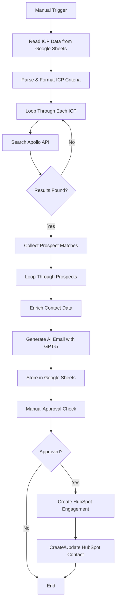

# 🚀 Automated B2B Lead Generation & Outreach Pipeline

<div align="center">


**An intelligent workflow that automates B2B lead generation, enrichment, and personalized outreach at scale**

[Features](#-features) • [Installation](#-installation) • [Usage](#-usage) • [Configuration](#-configuration)

</div>

---

## 📋 Overview

This n8n workflow automates the entire B2B lead generation and outreach process by intelligently sourcing prospects from Apollo.io based on Ideal Customer Profile (ICP) criteria, enriching contact data, generating AI-powered personalized emails, and seamlessly syncing approved contacts to HubSpot CRM.

Perfect for sales teams, BDRs, and marketing professionals looking to scale their outreach efforts while maintaining personalization and quality.

---

## ✨ Features

### 🎯 **Intelligent Lead Sourcing**
- Automated prospect search using Apollo.io API
- ICP-based filtering (industry, role, geography, company size)
- Boolean search support for advanced targeting
- Pagination handling for large result sets

### 🔍 **Data Enrichment**
- Bulk contact enrichment via Apollo API
- Email verification and validation
- LinkedIn profile integration
- Company and job title information

### 🤖 **AI-Powered Personalization**
- GPT-5 integration for email generation
- Context-aware messaging based on prospect data
- Multiple client signature support (B2BBD, Ligentia, Wogi, Iterable, Vypr)
- Industry and role-specific value propositions

### 📊 **Google Sheets Integration**
- Dynamic ICP configuration management
- Automated lead storage and tracking
- Manual approval workflow
- Real-time data synchronization

### 🔄 **HubSpot CRM Sync**
- Automatic contact creation/updates
- Engagement tracking
- Email activity logging
- Seamless CRM integration

---

## 🏗️ Architecture

### Workflow Diagram



### Data Flow

1. **Input Layer**: ICP definitions from Google Sheets
2. **Processing Layer**: Apollo API searches and data enrichment
3. **AI Layer**: GPT-5 email generation with context
4. **Storage Layer**: Results stored in Google Sheets
5. **CRM Layer**: Approved contacts synced to HubSpot

---

## 🛠️ Tech Stack

| Technology | Purpose |
|------------|---------|
| **n8n** | Workflow automation platform |
| **Apollo.io API** | B2B contact database and enrichment |
| **OpenAI GPT-5-Mini** | AI email content generation |
| **Google Sheets API** | Data storage and configuration |
| **HubSpot API** | CRM integration and engagement tracking |
| **JavaScript (Node.js)** | Custom data transformation logic |

---

## 📦 Prerequisites

Before you begin, ensure you have:

- ✅ **n8n instance** (self-hosted or cloud)
- ✅ **Apollo.io account** with API access
- ✅ **OpenAI API key** (GPT-5 access)
- ✅ **Google Cloud Project** with Sheets API enabled
- ✅ **HubSpot account** with API credentials
- ✅ Basic understanding of n8n workflows

### Required API Keys & Credentials

1. **Apollo.io API Key**
   - Sign up at [apollo.io](https://apollo.io)
   - Navigate to Settings → Integrations → API
   - Generate and copy your API key

2. **OpenAI API Key**
   - Create account at [platform.openai.com](https://platform.openai.com)
   - Go to API Keys section
   - Generate new secret key

3. **Google Sheets OAuth2**
   - Create project in Google Cloud Console
   - Enable Google Sheets API
   - Create OAuth 2.0 credentials

4. **HubSpot OAuth2**
   - Access HubSpot Developer account
   - Create private app or use OAuth
   - Configure required scopes

---

## 🚀 Installation

### Step 1: Clone the Repository

```bash
git clone https://github.com/yourusername/n8n-apollo-lead-generation.git
cd n8n-apollo-lead-generation
```

### Step 2: Import Workflow to n8n

1. Open your n8n instance
2. Click **"Import from File"** or **"Import from URL"**
3. Select `workflow.json` from this repository
4. The workflow will be imported with all nodes

### Step 3: Configure Credentials

Set up the following credentials in n8n:

#### Apollo.io API
```
Type: Header Auth
Name: x-api-key
Value: YOUR_APOLLO_API_KEY
```

#### OpenAI
```
Type: OpenAI API
API Key: YOUR_OPENAI_API_KEY
```

#### Google Sheets
```
Type: OAuth2
Follow n8n's Google Sheets authentication flow
```

#### HubSpot
```
Type: OAuth2
Follow n8n's HubSpot authentication flow
```

### Step 4: Configure Google Sheets

Create two Google Sheets:

#### 1. ICP Configuration Sheet
Columns:
- `Client` - Client/company name
- `Industry Focus` - Target industries (comma-separated)
- `Key Buyer Personas` - Target job titles (comma-separated)
- `Geography` - Target locations (comma-separated)
- `Target Company Size` - Company size criteria
- `Boolean Search Filter (Apollo/LinkedIn)` - Advanced search terms
- `Pain Points Solved` - Value proposition points
- `Tech Maturity` - Technology adoption level
- `Sales Cycle` - Expected sales cycle length

#### 2. Leads Output Sheet
Columns:
- `Email`
- `First Name`
- `Last Name`
- `Phone Number`
- `Message`
- `Job Title`
- `B2BBD Client Name`
- `Company Name`
- `Linkedin URL`
- `Approval` (values: pending/pass/fail)
- `Industry`

---

## ⚙️ Configuration

### Environment Variables

Create a `.env` file (if using environment variables):

```env
APOLLO_API_KEY=your_apollo_api_key
OPENAI_API_KEY=your_openai_api_key
GOOGLE_SHEETS_ICP_ID=your_icp_sheet_id
GOOGLE_SHEETS_LEADS_ID=your_leads_sheet_id
HUBSPOT_SENDER_EMAIL=nica.parana@b2bbdsales.com
```

### Workflow Settings

Update the following in the workflow nodes:

1. **HTTP Request (Apollo Search)**
   - Update `x-api-key` header with your Apollo API key

2. **Get row(s) in sheet**
   - Update `documentId` with your ICP Google Sheet URL

3. **Append or update row in sheet**
   - Update `documentId` with your Leads Google Sheet URL

4. **Message a model (OpenAI)**
   - Verify API credentials are set
   - Adjust prompt if needed for your use case

5. **Create an engagement (HubSpot)**
   - Update `fromEmail` to your sending address

---

## 💡 Usage

### Running the Workflow

1. **Manual Execution**
   - Click "Execute Workflow" button in n8n
   - Workflow will process all ICP entries

2. **Scheduled Execution** (Currently Disabled)
   - Enable the "Schedule Trigger" node
   - Set desired schedule (default: daily at 8 AM)

### Workflow Process

#### **Step 1: Lead Generation Pipeline**

1. **Reads ICP data from Google Sheets**
   - Fetches all configured ICPs
   - Parses search criteria and filters

2. **Searches Apollo API for matching prospects**
   - Executes search with ICP parameters
   - Handles pagination automatically
   - Filters for verified emails only

3. **Enriches contact data with detailed information**
   - Bulk matches contacts via Apollo
   - Retrieves phone numbers, LinkedIn URLs
   - Collects employment history

4. **Generates personalized cold emails using GPT-5**
   - Creates context-aware email content
   - Includes prospect research signals
   - Adapts tone based on industry/role
   - Uses appropriate client signature

5. **Stores results in Google Sheets for approval**
   - Appends or updates lead records
   - Sets approval status to "pending"
   - Includes all enriched data

6. **Syncs approved contacts to HubSpot CRM**
   - Creates engagement records
   - Updates contact properties
   - Logs email activity

### Customization

#### Modify Email Template

Edit the prompt in the "Message a model" node:

```javascript
// Adjust tone, structure, or client signatures
<tone>
Professional but warm
Consultative and confident
Never pushy
</tone>
```

#### Adjust Search Criteria

Update the ICP Google Sheet with new:
- Industries
- Job titles
- Geographic regions
- Company keywords

#### Add New Client Signatures

In the "Message a model" node prompt, add:

```
If {{ $json.clientName }} is exactly "NewClient", use ONLY this closing:
Best regards,
[Your Name]
[Your Title]
[Contact Info]
```

---

## 📊 Monitoring & Logs

### View Execution Results

1. Check n8n execution logs for errors
2. Monitor Google Sheets for new leads
3. Review HubSpot for synced contacts
4. Track email approval workflow

### Common Issues & Troubleshooting

| Issue | Solution |
|-------|----------|
| Apollo API rate limit | Add wait nodes between requests |
| No email found | Check Apollo search criteria |
| GPT timeout | Increase timeout in node settings |
| Google Sheets auth error | Refresh OAuth2 credentials |
| HubSpot sync failure | Verify contact property mappings |

---

## 🔒 Security Best Practices

- ✅ Store API keys in n8n credentials (never in workflow JSON)
- ✅ Use environment variables for sensitive data
- ✅ Regularly rotate API keys
- ✅ Limit Google Sheets sharing permissions
- ✅ Enable HubSpot API logging for auditing
- ✅ Review and approve leads before CRM sync

---

## 📈 Performance Optimization

- **Batch Processing**: Uses split-in-batches for large datasets
- **Rate Limiting**: Built-in wait nodes prevent API throttling
- **Pagination**: Automatic handling of paginated results
- **Error Handling**: Retry logic on failed requests
- **Data Validation**: Ensures email and required fields exist

---

## 🤝 Contributing

Contributions are welcome! Please follow these steps:

1. Fork the repository
2. Create a feature branch (`git checkout -b feature/AmazingFeature`)
3. Commit your changes (`git commit -m 'Add some AmazingFeature'`)
4. Push to the branch (`git push origin feature/AmazingFeature`)
5. Open a Pull Request

---

## 📄 License

This project is licensed under the MIT License - see the [LICENSE](LICENSE) file for details.

---

## 🙏 Acknowledgments

- **n8n Community** - For the amazing automation platform
- **Apollo.io** - For comprehensive B2B data access
- **OpenAI** - For powerful AI capabilities
- **B2BBD Team** - For workflow requirements and testing

---

## 📞 Support

For questions or issues:

- 📧 Email: zandergarcia552@gmail.com
- 🐛 Issues: [GitHub Issues](https://github.com/SingDevX/n8n-apollo-lead-generation/issues)
- 💬 Discussions: [GitHub Discussions](https://github.com/SingDevX/n8n-apollo-lead-generation/discussions)

---

<div align="center">

**⭐ Star this repo if you find it helpful!**

Made with ❤️ by Zander "Sing"

</div>
